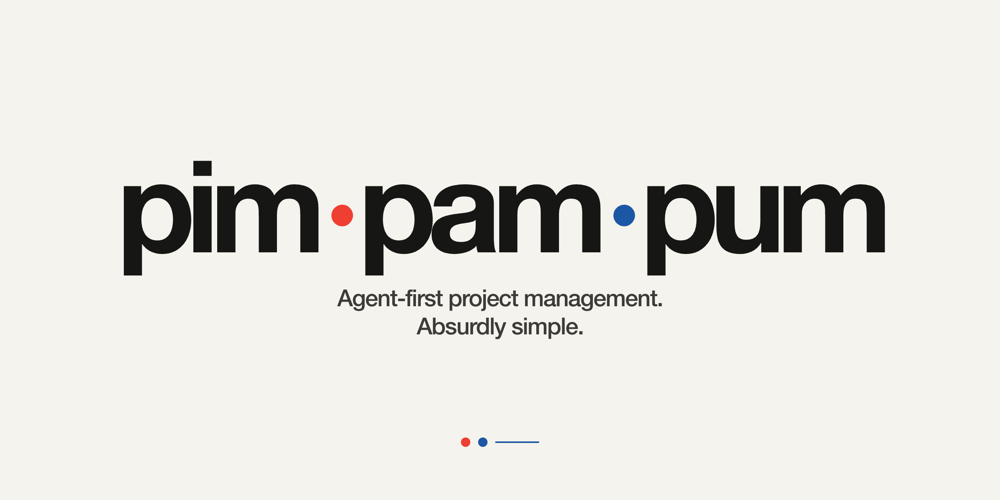

# Pimpampum



**Project management for people who are already the whole company.**

Pimpampum is an ultra-minimal, agent-first project manager for solopreneurs running a portfolio of
products. One tiny local service gives every repository and every agent the same operational
memory: initiatives, specs, context, tasks, active work, and what happened next.

No sprint planning. No backlog-grooming ceremony. No mandatory discussion about whether a task
feels more like a three or a five today. You are already in enough meetings with yourself.

## One small control room for your product portfolio

Your products may live in different repositories. Your agents may come from different vendors.
Your brain may occasionally decline to remember what happened three Tuesdays ago. Pimpampum gives
all of them one deterministic source of truth without asking you to move your work into another
cloud dashboard.

An agent working inside any registered repository can:

- Resolve the current product from its working directory.
- Read only the executable Spec and contextual pages it needs.
- Discover available work and claim it atomically before touching code.
- Complete or release work with a durable summary and artifact references.
- Leave the initiative ready for whichever agent—or human—turns up next.

Humans, scripts, and agents see the same state through MCP, CLI, or HTTP. Data stays local in
SQLite. Product intent stays readable in Markdown. Integrations speak deterministic JSON. Boring
formats are excellent colleagues.

## The useful bits

| You need to…                                    | Pimpampum gives you…                                      | Use…                                         |
| ----------------------------------------------- | --------------------------------------------------------- | -------------------------------------------- |
| See the state of every product                  | One portfolio overview and native status indicator        | `pimpampum overview` or the desktop menu     |
| Preserve product intent                         | Specs and scoped Context documents in Markdown            | `spec_read`, `context_list`, `context_read`  |
| Break work down, but not into dust              | Tasks and one optional level of Subtasks                  | `task_create`, `task_list`, `task_read`      |
| Stop agents doing the same job twice            | Atomic, expiring Claims                                   | `work_list`, `work_start`, `work_renew`      |
| Hand work to the next agent                     | Completion summaries, releases, and artifact references   | `work_complete` or `work_release`            |
| Use whichever agent you like                    | MCP, a JSON-first CLI, and a documented local API         | `pimpampum tools`, `pimpampum call`, OpenAPI |
| Work on the same portfolio on several computers | Immutable JSON snapshots through any shared folder        | **Settings…** or `pimpampum sync configure`  |
| Keep a recovery copy                            | Automatic SQLite backup to a local or synchronized folder | `pimpampum backup configure`                 |

## The deliberately small model

```text
Local instance
└── Workspace                      product or registered repository
    ├── Context document           workspace-wide durable knowledge
    └── Project                    bounded initiative or outcome
        ├── Context document       knowledge shared by its Specs
        └── Spec                   executable Markdown specification
            └── Task               executable work derived from the Spec
                └── Subtask        one optional level
```

### Domain language

| Term                   | Definition                                                                                                                                                                   |
| ---------------------- | ---------------------------------------------------------------------------------------------------------------------------------------------------------------------------- |
| **Local instance**     | The single Pimpampum daemon and database on one machine. Every registered Workspace and connected agent shares it.                                                           |
| **Workspace**          | A product or body of work anchored to one filesystem root, such as Pimpampum. It owns Projects and Workspace-wide Context.                                                   |
| **Project**            | A bounded initiative or outcome inside a Workspace. It groups one or more related Specs and shared Context. It is a container, not a directly executable job.                |
| **Spec**               | The canonical Markdown description of one deliverable. It may describe a feature, requirement, bug, refactor, migration, research effort, or something equally inconvenient. |
| **PRD**                | A product-requirements form of a Spec. Useful product language, but not a separate Pimpampum entity.                                                                         |
| **Context document**   | Supplementary Markdown scoped explicitly to a Workspace or Project: architecture, research, conventions, decisions, brand, and similar durable knowledge.                    |
| **Task**               | A concrete unit of work owned by one Spec. When it has open Subtasks, agents work on those leaves first.                                                                     |
| **Subtask**            | A child Task used to split larger work. Pimpampum permits one Subtask level and no recursive project-management fan fiction.                                                 |
| **Claim**              | An expiring lease that reserves one executable Spec or leaf Task for one agent.                                                                                              |
| **Doing**              | A derived status shown while a valid Claim exists. It is never persisted as a lifecycle state.                                                                               |
| **Completion summary** | A concise, durable record of what changed when work finishes.                                                                                                                |
| **Artifact reference** | A durable URI pointing to an output such as a commit, file, report, pull request, or build.                                                                                  |
| **Revision**           | A monotonically increasing version used to detect concurrent edits before anything is overwritten.                                                                           |

The relationships are strict: a Workspace has many Projects, a Project has many Specs, and a Spec
has many Tasks. Every Task belongs to exactly one Spec. Every Subtask belongs to exactly one
top-level Task in that same Spec.

Projects move through `draft | open | paused | done | cancelled`. Specs use
`draft | ready | done | cancelled`. Tasks and Subtasks use `open | done | cancelled`. A ready Spec
without open Tasks can be claimed directly; once open Tasks exist, only leaf Tasks are claimable.
`doing` appears only when a live Claim exists. Terminal records and activity remain available, so
“cancelled” never quietly means “we deleted the evidence.”

## Architecture

```text
Agents in any registered repository
        │
        ├── MCP Streamable HTTP
        ├── MCP stdio bridge
        ├── HTTP + OpenAPI 3.1
        └── JSON-first CLI
                │
          one local daemon
                │
        SQLite + Markdown/JSON export
```

The MCP stdio bridge is stateless: every operation reaches the same authenticated daemon. Codex,
Claude, VCOMP, rdiaz racing, and anything else living under `100-projects` can share one
coordination service without creating a tiny lonely database in every repository.

## Requirements

- Node.js 22 or newer.
- macOS 13+ on Apple Silicon for the menu-bar app.
- Omarchy Quattro for the dedicated Quickshell widget.

## Install once

The quickest cross-platform installation is:

```bash
npm install --global pimpampum
pimpampum install
```

`pimpampum install` installs one per-user background service and starts the local daemon at login.
No root access and no terminal window kept alive as a shrine. Inspect it with `pimpampum status`;
remove only Pimpampum-owned runtime integrations with `pimpampum uninstall`. The database, token,
logs, backups, and exports are preserved.

Update in place without uninstalling or losing local data:

```bash
pimpampum update:check
pimpampum update
```

`update:check` is read-only. `update` installs the latest published npm release and then runs that
new CLI's idempotent installer to reconcile the background service and desktop integration. The
same manual controls are available under **Settings → Updates** on macOS and in the Pimpampum
settings popout on Omarchy. On macOS the panel asks you to quit and reopen the menu-bar app after
an install, because the reconciliation only reactivates the instance that is already running.

On macOS, you can instead download the signed menu-bar app from GitHub Releases. Its first-run
screen copies the runtime command and opens Terminal for you:

```bash
npm install --global pimpampum && pimpampum install --service-only
```

`--service-only` creates the daemon, CLI and MCP integration without copying or replacing the app
you downloaded. The onboarding registers that app in Login Items; if macOS requires approval, the
normal status view links directly to the relevant System Settings page. If macOS rejects the
registration outright, the install still completes with `loginItem: "error"` in its receipt, and
the status view shows a notice from which it can be retried. On Omarchy, use the
standard `pimpampum install` flow so the npm package can add both the systemd user service and
Quattro widget.

To install a development checkout instead:

```bash
gh repo clone r-bart/pimpampum
cd pimpampum
npm ci
npm run build
npm run build:macos # macOS only
npm run cli -- install
```

When running from source, replace `pimpampum <command>` below with
`npm run cli -- <command>`.

The daemon listens on `http://127.0.0.1:7337` and creates:

```text
~/.pimpampum/
  pimpampum.sqlite
  settings.json     # after automatic backup is configured
  token
  .instance.lock
  logs/
```

Run only the foreground development daemon with `npm run dev`.

## Downloads and release artifacts

Tagged versions are published under [GitHub Releases](https://github.com/r-bart/pimpampum/releases).
Each release contains the installable npm tarball, the signed and notarized Apple Silicon menu-bar
app, `SHA256SUMS`, and release notes. The macOS app is the recommended native download; its Quiet
onboarding guides the user through the npm runtime installation and detects the daemon as soon as
it is ready.

GitHub downloads from a private repository require read access. The public npm package remains the
canonical runtime channel because it carries the daemon, CLI, MCP bridge, and Omarchy integration.
Source-built macOS apps are unsigned development artifacts; published V1 artifacts pass Developer
ID signing, notarization, and Gatekeeper checks.

## A complete first workflow

### 1. Register a repository

```bash
pimpampum workspace:add vcomp "VCOMP" /absolute/path/to/vcomp
pimpampum workspace:list
```

Nested directories resolve to the most specific registered Workspace.

### 2. Create the initiative and its first Spec

```bash
pimpampum project:create vcomp authentication "Authentication"

pimpampum spec:create \
  <project-id> \
  passwordless-login \
  "Passwordless login" \
  /absolute/path/to/spec.md
```

Both begin as drafts. A Project needs at least one Spec before opening. A Spec needs non-blank
Markdown before becoming ready:

```bash
pimpampum project:open <project-id> <project-revision>
pimpampum spec:ready <spec-id> <spec-revision>
```

Expected revisions make a stale writer fail with `revision_conflict` instead of politely erasing
newer work.

### 3. Add Tasks only when they help

```bash
pimpampum task:create <spec-id> "Implement authentication"
pimpampum task:create <spec-id> "Add end-to-end tests" <parent-task-id>
```

No Tasks are required. A ready Spec with no open Tasks is executable work itself. If Tasks exist,
agents claim available leaves.

### 4. Claim and finish work

```bash
pimpampum work:list vcomp <project-id> <spec-id>
pimpampum work:start task <task-id> codex-thread-123
pimpampum work:renew task <task-id> codex-thread-123
pimpampum work:complete task <task-id> codex-thread-123 <revision> "Delivery complete"
```

Use the same stable agent ID for the Claim lifetime. Release unfinished work with a handoff note:

```bash
pimpampum work:release task <task-id> codex-thread-123 "Tests remain for the next agent"
```

After every Task is terminal, claim and complete the Spec. When every Spec is terminal, complete
the Project without a Claim:

```bash
pimpampum work:start spec <spec-id> codex-thread-123
pimpampum work:complete spec <spec-id> codex-thread-123 <revision> "Spec delivered"
pimpampum project:complete <project-id> <revision> "Initiative delivered"
```

Projects may also be paused and reopened. Cancelling a Project, Spec, or Task atomically cancels
its non-terminal descendants and releases their Claims while preserving history.

## Using Pimpampum from agents

The short version lives in [docs/agents.md](docs/agents.md): install, MCP
configuration, the three calls, the model, and the rules an agent must respect.
Give an agent that file, or this brief:

```text
Use Pimpampum as the shared project memory.
Resolve the current Workspace, list available work, and claim exactly one Spec or leaf Task before editing.
Read only the relevant Spec, Task, and explicitly scoped Context documents.
When finished, complete or release the Claim with a concise summary and artifact references.
```

That is the workflow. The rest is wiring.

### MCP

Streamable HTTP:

```text
POST http://127.0.0.1:7337/mcp
Authorization: Bearer <local-token>
```

For MCP hosts that only support stdio, this is the whole configuration:

```json
{
  "mcpServers": {
    "pimpampum": { "command": "pimpampum-mcp" }
  }
}
```

The stdio bridge resolves its own credentials from the local data directory, so
the agent never handles a token. Hosts that expect only the inner object want
`{ "command": "pimpampum-mcp", "args": [] }`.

`pimpampum mcp` starts the same bridge through the main binary. That is the route MCP registry
clients use (`npx pimpampum mcp`), because `npx pimpampum` alone resolves to the CLI. Both routes
resolve the local token themselves.

Recommended flow:

```text
workspace_resolve
  → work_list
  → work_start
  → spec_read and/or task_read
  → context_list / context_read for the explicit scope needed
  → work_complete or work_release
```

The canonical catalog holds 32 domain tools:

```text
workspace_list          workspace_resolve

project_list            project_get             project_create
project_update          project_complete        project_cancel
project_completion_get

spec_list               spec_get                spec_read
spec_create             spec_update             spec_completion_get
spec_cancel

task_list               task_get                task_read
task_create             task_update             task_completion_get
task_cancel

context_list            context_read            context_put
activity_list

work_list               work_start              work_renew
work_release            work_complete
```

The daemon adds four synchronization tools, so `tools/list` returns 36 over HTTP:

```text
sync_status             sync_now
sync_conflict_list      sync_conflict_read
```

The stdio bridge exposes the 32 domain tools only. A stdio session starts at `workspace_resolve`;
`sync_status` is available to HTTP clients alone.

No transitional aliases are exposed. The live MCP `tools/list` result is authoritative and
includes strict schemas, defaults, descriptions, bounds, and effect annotations. The full human
reference is [docs/mcp-tools.md](docs/mcp-tools.md).

### Agent-first CLI

MCP is preferred. A shell-only agent can still install, configure, discover, and call the exact
same contract without hard-coding HTTP routes:

```bash
pimpampum install
pimpampum status
pimpampum commands
pimpampum config
pimpampum tools
pimpampum call workspace_resolve --input '{"path":"/absolute/project/path"}'
```

`pimpampum commands` describes the CLI to itself: every verb with its arguments, its options, its
usage line, and the same effect annotations MCP tools carry (`readOnlyHint`, `destructiveHint`,
`idempotentHint`) plus `requiresDaemon`. `--help`, `-h`, `--version`, and `-v` all work and exit 0.

`config` works while offline and reports the effective data directory, base URL, redacted token
source, MCP URL, and stdio command. It never prints the bearer token.

Call a tool with inline JSON, standard input, or a UTF-8 file:

```bash
pimpampum call workspace_list

pimpampum call work_list \
  --input '{"workspaceId":"vcomp","projectId":null,"specId":null,"limit":20}'

printf '%s' '{
  "projectId": "PROJECT_ID",
  "slug": "agent-cli",
  "title": "Agent-first CLI",
  "body": "# Contract\n\nExpose the complete MCP surface.",
  "actor": "codex-thread-123"
}' | pimpampum call spec_create --stdin

pimpampum call work_complete --input-file ./complete-work.json
```

Choose exactly one input source: `--input`, `--stdin`, or `--input-file`. Calls accept JSON objects
up to 2,000,000 UTF-8 bytes.

Every Pimpampum command writes one `{ "data": ... }` envelope to stdout and exits 0, or one
actionable `{ "error": ... }` envelope to stderr and exits non-zero. `help` is the single exception:
it prints the text banner. Errors carry a stable `code`, a `retryable` boolean, and a `suggestion`.
When the daemon does not answer, the code is `unavailable` and the suggestion names the recovery
command, so an agent never has to guess whether the failure is transport or domain.

## HTTP and OpenAPI

Every `/api/v1` and `/mcp` request requires:

```http
Authorization: Bearer <local-token>
```

The token lives at `~/.pimpampum/token` unless another data directory is configured.

```bash
curl \
  -H "Authorization: Bearer $(tr -d '\n' < ~/.pimpampum/token)" \
  http://127.0.0.1:7337/api/v1/workspaces
```

The public loopback OpenAPI 3.1 document is available at:

```text
GET http://127.0.0.1:7337/openapi.json
```

It documents all Workspace, Project, Spec, Task, scoped Context, work, activity, portfolio
overview, synchronization, backup, and export operations. `/health` and `/openapi.json` are the
only unauthenticated routes. Ordinary success envelopes use HTTP schema version 1; the
independently versioned portfolio overview uses schema version 2 because the macOS and Omarchy
clients validate it strictly.

Domain Model v2 deliberately keeps the pre-release `/api/v1` route prefix. The version of the
resource model and the URL prefix are separate boundaries. A minimal HTTP creation flow is:

```bash
TOKEN="$(tr -d '\n' < ~/.pimpampum/token)"

curl -X POST http://127.0.0.1:7337/api/v1/projects \
  -H "Authorization: Bearer $TOKEN" \
  -H 'Content-Type: application/json' \
  -d '{"workspaceId":"vcomp","slug":"authentication","title":"Authentication","actor":"human"}'

curl -X POST http://127.0.0.1:7337/api/v1/projects/PROJECT_ID/specs \
  -H "Authorization: Bearer $TOKEN" \
  -H 'Content-Type: application/json' \
  -d '{"slug":"passwordless-login","title":"Passwordless login","body":"# Passwordless login","actor":"human"}'
```

Use `PATCH /api/v1/projects/{projectId}` and `PATCH /api/v1/specs/{specId}` with
`expectedRevision` for reversible lifecycle changes. Executable work is listed at
`GET /api/v1/work` and Claims accept only `spec` or `task`. Refer to `/openapi.json` for exact
request and response schemas rather than reproducing them in an agent prompt.

## CLI reference

Generated by `pimpampum help`. `pimpampum commands` returns the same catalog as JSON, with
per-argument descriptions and effect annotations.

```text
Pimpampum 1.1.3

Every command writes one {"data": ...} envelope to stdout and exits 0, or one
{"error": ...} envelope to stderr and exits non-zero. The only
exceptions are `help`, which prints this text, and `mcp`, whose stdout carries
the MCP protocol. Run `pimpampum commands` for the same catalog as JSON, and
`pimpampum tools` for the domain tool schemas.

Use `--` to end option parsing when a value itself begins with two dashes.

Usage:
  pimpampum help
  pimpampum version
  pimpampum commands
  pimpampum config
  pimpampum serve
  pimpampum mcp
  pimpampum install [--service-only]
  pimpampum status
  pimpampum update:check
  pimpampum update
  pimpampum uninstall
  pimpampum health
  pimpampum overview
  pimpampum tools
  pimpampum call <tool-name> [--input <json>] [--stdin] [--input-file <path>]
  pimpampum workspace:list
  pimpampum workspace:add <workspace-id> <name> <root-path> [--actor <id>]
  pimpampum work:list [workspace-id] [project-id] [spec-id] [--limit <n>]
  pimpampum work:start <spec|task> <target-id> <agent-id> [--lease-seconds <n>]
  pimpampum work:renew <spec|task> <target-id> <agent-id> [--lease-seconds <n>]
  pimpampum work:release <spec|task> <target-id> <agent-id> [note] [--note <text>]
  pimpampum work:complete <spec|task> <target-id> <agent-id> <revision> <summary> [--artifact <uri>]... [--artifacts <json>]
  pimpampum project:create <workspace-id> <slug> <title> [--actor <id>]
  pimpampum project:get <project-id>
  pimpampum project:draft <project-id> <revision> [--actor <id>]
  pimpampum project:open <project-id> <revision> [--actor <id>]
  pimpampum project:pause <project-id> <revision> [--actor <id>]
  pimpampum project:complete <project-id> <revision> <summary> [--artifact <uri>]... [--artifacts <json>] [--actor <id>]
  pimpampum project:cancel <project-id> <revision> <reason> [--actor <id>]
  pimpampum spec:create <project-id> <slug> <title> [body-file] [--body-file <path>] [--actor <id>]
  pimpampum spec:get <spec-id>
  pimpampum spec:draft <spec-id> <revision> [--actor <id>]
  pimpampum spec:ready <spec-id> <revision> [--actor <id>]
  pimpampum spec:cancel <spec-id> <revision> <reason> [--actor <id>]
  pimpampum task:create <spec-id> <title> [parent-id] [--parent <id>] [--body-file <path>] [--actor <id>]
  pimpampum task:get <task-id>
  pimpampum task:cancel <task-id> <revision> <reason> [--actor <id>]
  pimpampum backup <directory>
  pimpampum backup status [--json]
  pimpampum backup configure <directory> [--json]
  pimpampum backup retry [--json]
  pimpampum backup disable [--json]
  pimpampum sync status [--json]
  pimpampum sync configure <directory> --device <id> [--json]
  pimpampum sync now [--json]
  pimpampum sync pause [--json]
  pimpampum sync resume [--json]
  pimpampum sync conflicts [--json]
  pimpampum sync resolve <conflict-id> <local|remote> [--json]
  pimpampum sync forget [--json]
  pimpampum export <directory>
```

Named commands cover common human operations. `tools` and `call` expose the complete MCP contract
as the canonical shell fallback for agents.

## Native status surfaces

The daemon is meant to disappear into the machine, not become a new pet process you check every
morning.

On **macOS 13+ on Apple Silicon**, download the signed menu-bar app and follow its one-command npm
setup, or install the complete bundle directly with `pimpampum install`. The menu shows portfolio
status, active Claims, current Spec/Task work, and every Project. Green means the
portfolio is terminal; an active badge means an agent owns work; an error means the daemon needs
attention. Click a Project to open its Workspace in Finder. **Settings…** configures updates,
automatic synchronization, and backup. **Quit** closes the menu app and deliberately leaves the
daemon running.
The published app is signed and notarized; a locally built development app is not. The app has no
Dock icon. It knows its place.

On **Omarchy Quattro**, installation adds a dedicated Quickshell widget and systemd user service.
The bar shows the same portfolio state and Claim count. Its popout lists current work and Projects,
opens Workspaces with `xdg-open`, and exposes the same update and backup controls. Other Linux
desktops receive the background service without the Quattro widget.

Both status clients are read-only apart from update, synchronization, and backup settings. Agents
do the work; the status bar simply tells you whether they are doing it.

## Persistence, backup, and export

### Synchronization between computers

Choose a folder that is already synchronized by Google Drive, Dropbox, iCloud Drive, Syncthing,
rclone, or an equivalent provider. Pimpampum creates a `Pimpampum/devices/<device>` namespace and
writes immutable, complete JSON snapshots there; every computer keeps its live SQLite database,
token, Claims, settings, and Workspace paths locally.

```bash
pimpampum sync configure "/path/to/your/shared/folder" --device linux-desktop --json
pimpampum sync status --json
```

After configuration, import runs at startup, on polling, and with `sync now`; export is automatic
after committed changes. The Settings toggle pauses/resumes an existing configuration. It is off
until the user chooses a folder, and automatic thereafter. If the provider is offline, local work
continues and is exported after recovery. Concurrent edits to unrelated entities merge; divergent
edits to the same base are preserved as visible conflicts without a timestamp winner.

Resolve one explicitly with `pimpampum sync resolve <id> local` to keep this machine's candidate,
or `remote` to keep the other candidate. The decision is published to every device. MCP agents may
explain the preserved candidates but never choose one autonomously.

Google does not provide an official Google Drive desktop client for Linux. A mounted/synchronized
folder from rclone or another Linux client works because Pimpampum integrates with the filesystem,
not a provider API. Do not place `pimpampum.sqlite` itself in a cloud-synchronized directory.

### Backup and portable export

The live SQLite database must remain in Pimpampum's local data directory. **Do not place it inside
Dropbox, Google Drive, or iCloud.** Synchronized databases are an exciting way to discover file
locking at the least convenient possible moment.

Backups and exports may target any locally mounted or synchronized folder:

```bash
pimpampum backup /path/to/Dropbox/pimpampum-backups
pimpampum export /path/to/iCloud/pimpampum-exports
```

- Manual backups are immutable, integrity-checked SQLite snapshots.
- Automatic backup atomically refreshes `pimpampum-latest.sqlite` after each successful mutation.
- Backup failure never rolls back committed local project work.
- Portable export is rejected while live Claims exist.
- Claims and bearer tokens are excluded from portable exports.

Choose automatic backup from **Settings…** on macOS, from **Backup** in the Quattro popout, or with:

```bash
pimpampum backup configure "/path/to/Dropbox/Pimpampum" --json
pimpampum backup status --json
pimpampum backup retry --json
pimpampum backup disable --json
```

The schema-v2 portable export is deterministic and readable:

```text
manifest.json                    schemaVersion: 2
workspaces.json
workspaces/<workspace-id>/
  context.json
  context/*.md
  projects/<project-slug>/
    project.json
    context.json
    context/*.md
    specs/<spec-slug>/
      spec.json
      spec.md
      tasks.json
```

To restore a SQLite backup: stop the daemon, preserve the token, move the failed database aside,
copy the selected snapshot to the configured `pimpampum.sqlite`, remove no unrelated files, avoid
stale `-wal` or `-shm` companions, restart, and verify `/health` plus a representative read.

## Configuration

| Variable             | Default                 | Purpose                |
| -------------------- | ----------------------- | ---------------------- |
| `PIMPAMPUM_DATA_DIR` | `~/.pimpampum`          | Private data directory |
| `PIMPAMPUM_HOST`     | `127.0.0.1`             | Loopback host          |
| `PIMPAMPUM_PORT`     | `7337`                  | Daemon port            |
| `PIMPAMPUM_TOKEN`    | Generated automatically | Local bearer token     |

The host must be loopback. A manually configured token must contain at least 32 printable ASCII
characters without spaces. One instance lock prevents two daemons from owning the same data
directory.

## Deliberate omissions

Pimpampum does not include the following, and nobody forgot to add them:

- Sprints, milestones, roadmaps, priorities, estimates, points, or labels.
- Users, teams, roles, comments, chat, notifications, or social feeds.
- Configurable workflows or arbitrary Task dependencies.
- More than one level of Subtasks.
- Cloud synchronization of the live database.
- A web interface in the first version.

These omissions keep the contract small enough for an agent to understand and a human to trust.
Excellent larger tools already exist for the rest; Pimpampum would like to remain comprehensible
before lunch.

## Development and quality

```bash
npm run typecheck
npm run lint
npm run format:check
npm test
npm run test:evals
npm run build
```

`npm test` builds from a clean `dist/`, enforces 100% statement, branch, function, and line
coverage, and runs the six compiled E2E scenarios. `npm run test:evals` runs only that deterministic
E2E gate: four product workflows plus two synthetic Git development sessions that test handoff,
restart, repository tests, commits, and artifact verification. It does not launch or evaluate an
LLM. The exact boundaries and rubric live in [docs/evals.md](docs/evals.md).

Native live validation remains separate and explicitly opt-in because it depends on the target
desktop and may touch the current user's installed integration:

```bash
PIMPAMPUM_RUN_LIVE_MACOS=1 npm run test:e2e:macos
PIMPAMPUM_QUATTRO_LIVE=1 npm run test:e2e:omarchy:live
```

From a clean Omarchy Quattro machine with no existing Pimpampum installation, the complete live
smoke starts from a fresh checkout. The npm command builds the CLI before exercising installation,
the native plugin, service controls, screenshots, cleanup, and evidence capture:

```bash
git clone https://github.com/r-bart/pimpampum.git
cd pimpampum
npm ci
PIMPAMPUM_QUATTRO_LIVE=1 npm run test:e2e:omarchy:live
```

The similarly named Quattro command below only validates the plugin; it does not run the live
workflow. If a `thoughts/evidence/quattro-live.json` has been captured,
`npm run check:quattro-evidence` verifies it against the current plugin:

```bash
npm run test:e2e:omarchy
```

Neither live smoke is a release gate. The release workflow regenerates the macOS artifact
approval and smoke on its own macOS runner; the Quattro smoke is opt-in evidence, recorded when a
person runs it, and its absence does not block a tag (decision of 2026-08-28).

## Status

The current release candidate is `1.1.3`: functional, local-first, and deliberately small. Every
future feature has one admission test: does it improve coordination more than it increases surface
area? If not, it can enjoy a fulfilling life in another product.

## License

MIT. See [LICENSE](LICENSE).
